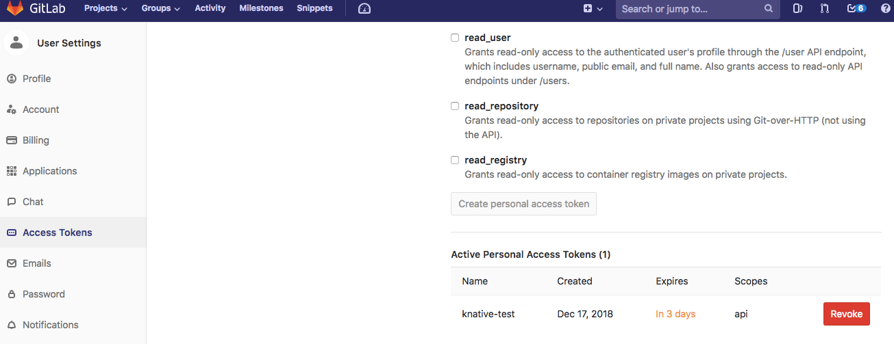

# GitLab Event Source for Knative

GitLab Source example shows how to wire GitLab events for consumption
by a Knative Service.

## Deployment Steps

We should be able to reproduce the [GitHub workflow](https://github.com/knative/docs/blob/master/eventing/samples/github-source/README.md).

### Create a Knative Service

Create a simple Knative `Service` that dumps incoming messages to its log. The `service.yaml` file
defines this basic service.

```yaml
apiVersion: serving.knative.dev/v1alpha1
kind: Service
metadata:
  name: gitlab-message-dumper
spec:
  runLatest:
    configuration:
      revisionTemplate:
        spec:
          container:
            image: gcr.io/knative-releases/github.com/knative/eventing-sources/cmd/message_dumper
```

Enter the following command to create the service from `service.yaml`:

```shell
kubectl -n default apply -f https://gitlab.com/triggermesh/gitlabsource/raw/master/message-dumper.yaml
```

### Create GitLab Tokens

Create a [personal access token](https://docs.gitlab.com/ee/user/profile/personal_access_tokens.html)
for GitLab that the GitLab source can use to register webhooks with
the GitLab API. Also decide on a secret token that your code will use
to authenticate the incoming webhooks from GitLab ([_secretToken_](https://docs.gitlab.com/ee/user/project/integrations/webhooks.html#secret-token)).

GitLab webhooks can be created and configured with the [Hook API](https://docs.gitlab.com/ee/api/projects.html#hooks)

Here's an example for a token named "knative-test" with the
recommended scopes:



Update `gitlabsecret.yaml` with those values. If your generated access
token is `'personal_access_token_value'` and you choose your _secretToken_
as `'asdfasfdsaf'`, you'd modify `gitlabsecret.yaml` like so:

```yaml
apiVersion: v1
kind: Secret
metadata:
  name: gitlabsecret
type: Opaque
stringData:
  accessToken: personal_access_token_value
  secretToken: asdfasfdsaf
```

Hint: you can makeup a random _secretToken_ with:

```shell
head -c 8 /dev/urandom | base64
```

Then, apply the gitlabsecret using `kubectl`:

```shell
kubectl --n default apply -f https://gitlab.com/triggermesh/gitlabsource/raw/master/gitlabsecret.yaml
```

### Create Event Source for GitLab Events

In order to receive GitLab events, you have to create a concrete Event
Source for a specific namespace. Be sure to replace the
`ownerAndRepository` value with a valid GitLab public repository owned
by your GitLab user.

```yaml
apiVersion: sources.eventing.triggermesh.dev/v1alpha1
kind: GitLabSource
metadata:
  name: gitlabsample
spec:
  eventTypes:
    - pull_request
  ownerAndRepository: <YOUR USER>/<YOUR REPO>
  accessToken:
    secretKeyRef:
      name: gitlabsecret
      key: accessToken
  secretToken:
    secretKeyRef:
      name: gitlabsecret
      key: secretToken
  sink:
    apiVersion: serving.knative.dev/v1alpha1
    kind: Service
    name: github-message-dumper
```

Then, apply that yaml using `kubectl`:

```shell
kubectl -n default apply -f https://gitlab.com/triggermesh/gitlabsource/raw/master/gitlabeventbinding.yaml
```

### Verify

Verify the GitLab webhook was created by looking at the list of
webhooks under the Settings/Integrations tab in your GitLab repository. A hook
should be listed that points to your Knative cluster.

### Create Events

Create a pull request in your Gitlab repository. We will verify
that the Gitlab events were sent into the Knative eventing system
by looking at our message dumper function logs.

```shell
kubectl --namespace default get pods
kubectl --namespace default logs gitlab-message-dumper-XXXX user-container
```

You should log lines similar to:

```
...
```
